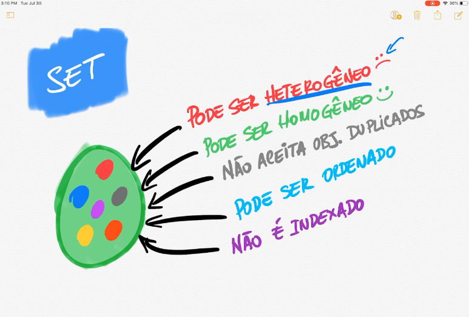
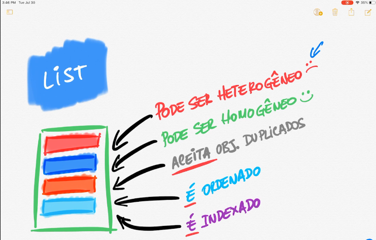

# Collections

- Possui tamanho dinâmico
- Pode ter dados de diferentes tipos
- Não suporta tipos primitivos (Pode-se usar os wrappers correspondentes)

## Dentre as collections estão:

## Set (conjunto)
- Não ordenado (por padrão)
- Não indexado
- Não aceita repetição
- A representação em um desenho seria um conjunto da matemática

## List
- Indexada
- Aceita repetição
- A representação em um desenho seria uma lista

## Map
- Chave/Valor
- Chave não aceita repetição
- A representação em um desenho seria uma tabela

## Queue
- Implementa fila
- First in/first out (FIFO)

## Stack
- Implementa pilha (STACK)
- Last in/first out (LIFO)